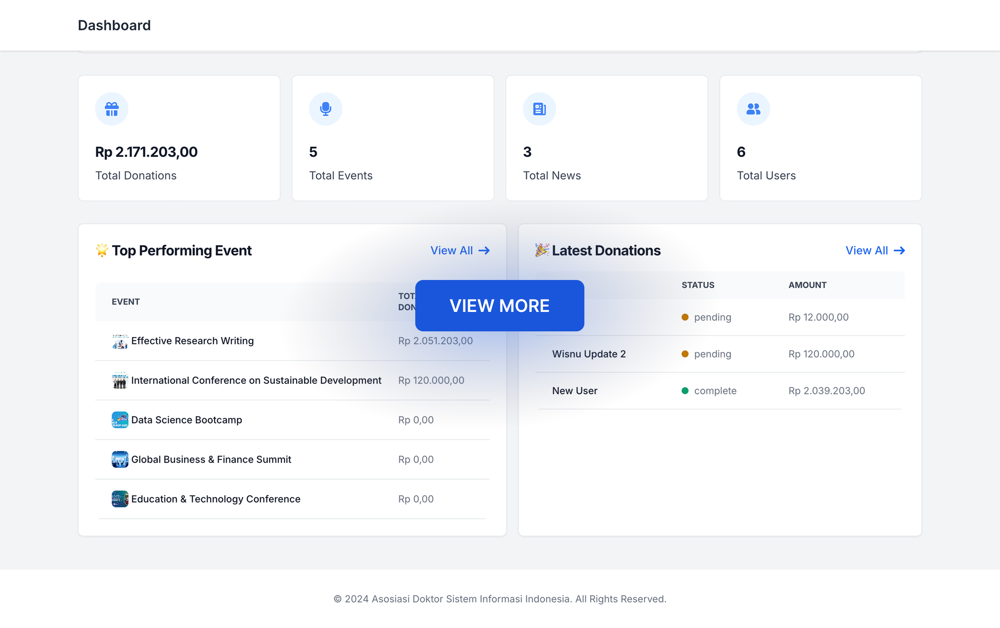

# Laravel Event Publications

## 📌 Introduction
Event Publications is a Laravel-based web application designed to manage and publish events efficiently. It provides features for event creation, user registrations, and news publications with robust admin control.

## ✨ Features
### 👤 User View
- 🔹 Authentications
- 🔹 User Verification
- 🔹 Event Registration
- 🔹 View Published Events
- 🔹 Donate to Events
- 🔹 Manage Personal Profile
- 🔹 Receive Notifications
- 🔹 Light & Dark Themes

### 🔑 Admin View
- 🔹 Event Management (Create, Update, Delete, Publish)
- 🔹 News Management (CRUD with Thumbnail & Rich Content Editor)
- 🔹 Slug Feature for Events
- 🔹 Donation System (User Inputs: Account Name, Amount, Bank, Proof)
- 🔹 Dashboard for Admins
- 🔹 Role-based Middleware (Admins redirected to Dashboard, Users to Homepage)
- 🔹 User Management (View, Edit, Delete)
- 🔹 Event Statistics (Total Events, Total Donations)
- 🔹 Publication, Partners, Jumbotron, etc Management (Create, Update, Delete)
- 🔹 File Uploads (Images, Documents)

## 🖼️ Preview

### User View

[](./PREVIEW.md#user-view)

### Admin View
[](./PREVIEW.md#admin-view)

## 🚀 Installation

### 🛠 Prerequisites
- 🐘 PHP 8+
- 🎼 Composer
- 🗄 MySQL or PostgreSQL
- 🌐 Node.js & npm (for front-end dependencies)

### ⚡ Setup
1. Clone the repository:
   ```sh
   git clone https://github.com/wisnuwiry/event-management-system.git
   cd event-management-system
   ```
2. Install dependencies:
   ```sh
   composer install
   npm install && npm run build
   ```
3. Set up environment variables:
   ```sh
   cp .env.example .env
   php artisan key:generate
   ```
4. Configure database settings in `.env` and run migrations:
   ```sh
   php artisan migrate --seed
   ```
5. Run vite:
   ```sh
   npm run dev
   ```
5. Start the development server:
   ```sh
   php artisan serve
   ```

## 🌍 Usage
- Access the application via `http://127.0.0.1:8000`
- Admin Dashboard: `/admin`
- Register/Login to access event features

## 🚢 Deployment

- Use Laravel Forge, Vapor, or manually deploy on a VPS.

## 🤝 Contributing
Pull requests are welcome. For major changes, please open an issue first to discuss the improvements.
